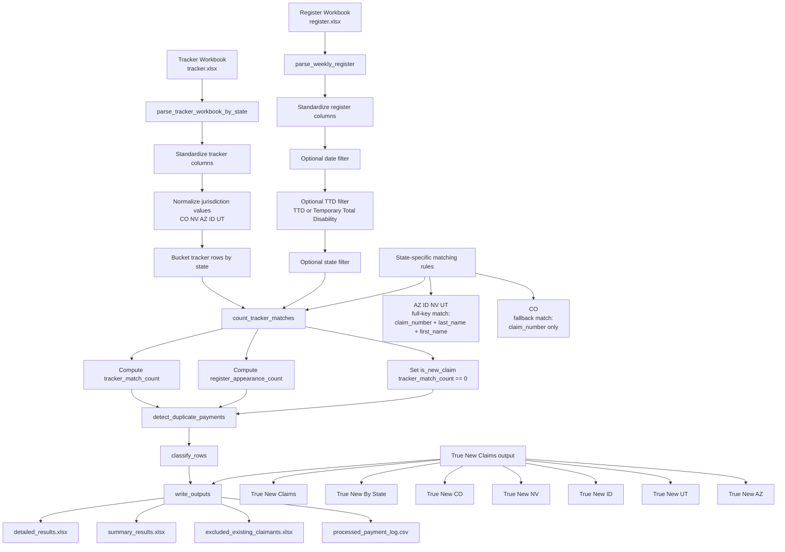

# Payment Claim Detector Architecture Diagram

This diagram reflects the current working architecture as implemented in the repository.

It is intended for future AI agents and engineers who need a fast visual map of how data moves through the system and where state-specific logic is applied.

## Notes

- The state-scoped tracker parse is the backbone of the architecture. Future changes should not flatten all states into one historical pool.
- The definition of a true new claim is count-based, not classification-based.
- `tracker_match_count == 0` is the authoritative signal for tracker-new rows.
- `classification` is still useful, but duplicates and adjustments can override how a row is labeled in the classification sheets.
- Colorado is intentionally handled differently because its tracker structure does not provide split first and last claimant name columns in the same way as the other states.
- Arizona is now part of the explicit TTD state map and is processed with full-key matching.

## Macro Design Intent

The design is optimized for auditable Excel reconciliation, not for pretending the tracker is the authoritative system of record.

The long-term likely evolution is:

1. keep the tracker-based reconciliation path for operational review
2. add CareMC API validation later
3. distinguish "new to tracker" from "new to system of record" as separate concepts
